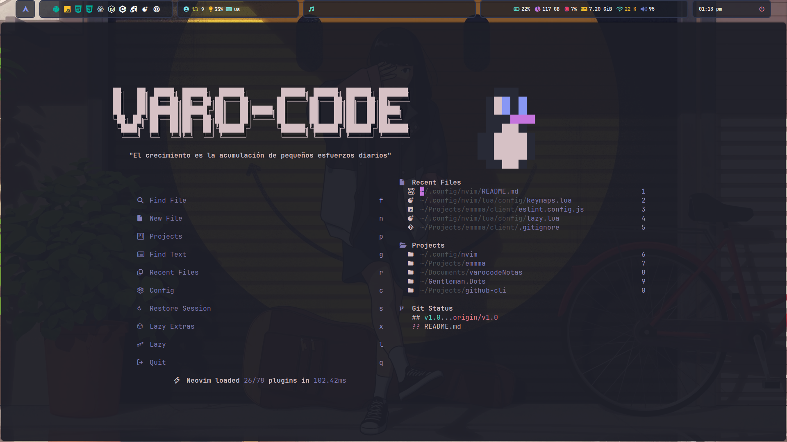
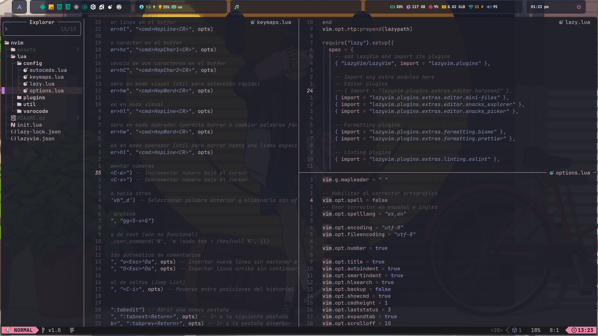
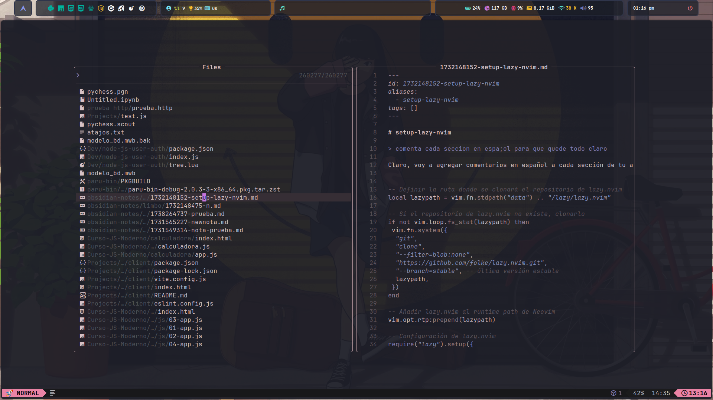
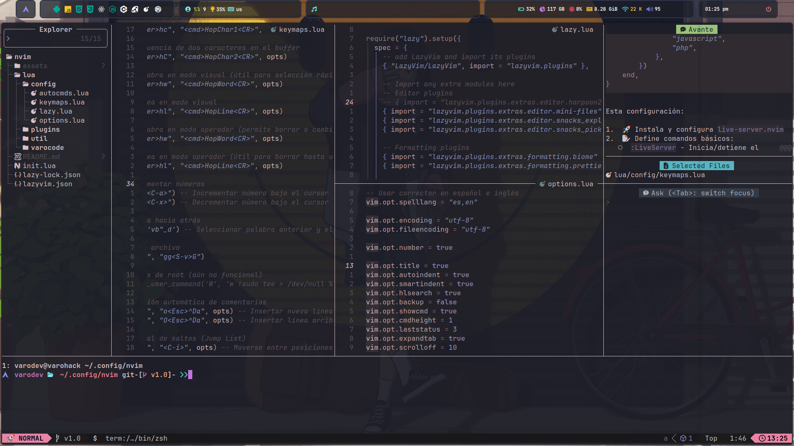
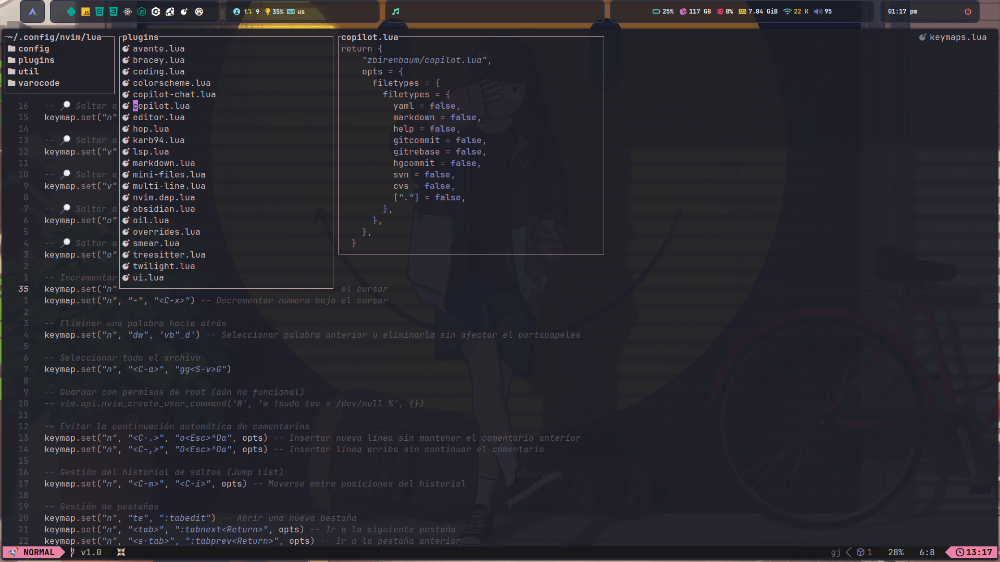

# 🚀 Mi Configuración de Neovim con LazyVim

Este repositorio contiene mi configuración personalizada de **Neovim**, basada en **LazyVim**, con un enfoque modular para facilitar la gestión, mantenimiento y optimización del entorno de desarrollo.

## 🌟 Vista Previa

### 🏠 **Pantalla de Inicio (Dashboard)**



### 📂 **Explorador de Archivos con Mini Files**



### 🔭 **Búsqueda Rápida con Telescope**



### 🖥️ **Interfaz Visual en Acción**



### 🎛️ **Mini Files en uso**



### ⌨️ **Atajos de Teclado con Which-Key**


---

## 📂 Estructura del Proyecto

La configuración está organizada en varias carpetas y archivos:

```bash
~/.config/nvim
│── README.md                # Archivo de documentación
│── init.lua                 # Archivo principal de configuración
│── lazy-lock.json           # Archivo de bloqueo de Lazy.nvim
│── lazyvim.json             # Configuración de LazyVim
│── lua/                     # Carpeta con toda la configuración en Lua
│   ├── config/              # Configuraciones principales
│   │   ├── autocmds.lua     # Autocomandos personalizados
│   │   ├── keymaps.lua      # Atajos de teclado
│   │   ├── lazy.lua         # Configuración de Lazy.nvim
│   │   ├── options.lua      # Opciones generales de Neovim
│   ├── plugins/             # Configuración modular de plugins
│   │   ├── avante.lua
│   │   ├── bracey.lua
│   │   ├── coding.lua
│   │   ├── colorscheme.lua
│   │   ├── copilot-chat.lua
│   │   ├── copilot.lua
│   │   ├── editor.lua
│   │   ├── hop.lua
│   │   ├── karb94.lua
│   │   ├── lsp.lua
│   │   ├── markdown.lua
│   │   ├── mini-files.lua
│   │   ├── multi-line.lua
│   │   ├── nvim.dap.lua
│   │   ├── obsidian.lua
│   │   ├── oil.lua
│   │   ├── overrides.lua
│   │   ├── smear.lua
│   │   ├── treesitter.lua
│   │   ├── twilight.lua
│   │   ├── ui.lua
│   ├── util/                # Utilidades y herramientas adicionales
│   │   ├── debug.lua
│   ├── varocode/            # Configuraciones personalizadas propias
│   │   ├── discipline.lua
│   │   ├── hsl.lua
│   │   ├── lsp.lua
```

---

## 📌 Explicación de Archivos y Carpetas

### **🛠 Archivos Base**

- **`init.lua`** → Punto de entrada de la configuración, carga `lazy.lua` y define ajustes iniciales.
- **`lazy-lock.json`** → Archivo de bloqueo de Lazy.nvim, mantiene versiones exactas de los plugins.
- **`lazyvim.json`** → Configuración general de LazyVim.

---

### **⚙️ `config/` (Configuraciones Principales)**

- **`autocmds.lua`** → Contiene autocomandos personalizados para optimizar la experiencia de Neovim.
- **`keymaps.lua`** → Define atajos de teclado personalizados para mejorar la productividad.
- **`lazy.lua`** → Gestiona la instalación y configuración de los plugins mediante Lazy.nvim.
- **`options.lua`** → Contiene configuraciones generales de Neovim (línea de comandos, codificación, tabs, etc.).

---

### **🔌 `plugins/` (Configuración de Plugins)**

Cada archivo en esta carpeta configura un plugin específico:

- **`avante.lua`** → Configuración de Avante, si está presente.
- **`bracey.lua`** → Integración con Bracey para recarga en vivo en desarrollo web.
- **`coding.lua`** → Plugins para mejorar la experiencia de desarrollo (refactorización, comentarios, etc.).
- **`colorscheme.lua`** → Configuración del esquema de colores y temas personalizados.
- **`copilot-chat.lua`** → Integración con **Copilot Chat** para sugerencias de código basadas en IA.
- **`copilot.lua`** → Configuración de **GitHub Copilot**.
- **`editor.lua`** → Plugins esenciales para mejorar la edición de código.
- **`hop.lua`** → Soporte para **Hop.nvim**, una herramienta de navegación rápida.
- **`karb94.lua`** → Configuración adicional de plugins no especificados en la lista.
- **`lsp.lua`** → Configuración completa de **LSPs** con soporte para múltiples lenguajes.
- **`markdown.lua`** → Mejoras en la edición de archivos **Markdown**.
- **`mini-files.lua`** → Explorador de archivos ligero con **Mini Files**.
- **`multi-line.lua`** → Manejo avanzado de múltiples líneas y cursores.
- **`nvim.dap.lua`** → Configuración para **Neovim DAP**, herramienta de depuración avanzada.
- **`obsidian.lua`** → Integración con **Obsidian**, ideal para tomar notas dentro de Neovim.
- **`oil.lua`** → Explorador de archivos alternativo con **Oil.nvim**.
- **`overrides.lua`** → Permite sobrescribir configuraciones predeterminadas de LazyVim.
- **`smear.lua`** → Plugin para edición avanzada (si está configurado).
- **`treesitter.lua`** → Configuración avanzada de **Treesitter** para análisis de sintaxis.
- **`twilight.lua`** → Plugin para mejorar la concentración ocultando líneas innecesarias.
- **`ui.lua`** → Configuración de la **interfaz de usuario** con mejoras visuales.

---

### **🛠 `util/` (Funciones Utilitarias)**

- **`debug.lua`** → Herramientas para depuración y mejoras en la consola.

---

### **🚀 `varocode/` (Configuraciones Personalizadas)**

Este directorio contiene configuraciones exclusivas creadas por **varocode**:

- **`discipline.lua`** → Implementa restricciones para mejorar la disciplina de escritura de código.
- **`hsl.lua`** → Funciones de conversión de colores entre **HEX y HSL**.
- **`lsp.lua`** → Configuraciones avanzadas adicionales para servidores LSP.

---

## 📥 Instalación y Uso

### 1️⃣ Clonar este repositorio en `~/.config/nvim`

```bash
git clone https://github.com/varocode/setup-nvim.git ~/.config/nvim
```

### 2️⃣ Instalar Neovim y dependencias

Asegúrate de tener Neovim (versión 0.9 o superior) y Git instalado.

### 🐧 En Linux (Debian/Ubuntu)

```bash
sudo apt update && sudo apt install neovim git -y
```

### 🏴 En Arch Linux (o Manjaro)

```bash
sudo pacman -S neovim git

```

### 🍎 En macOS (usando Homebrew)

```bash
brew install neovim
```

### 3️⃣ Instalar Lazy.nvim

Lazy.nvim se instalará automáticamente al iniciar Neovim por primera vez.

Ejecuta:

```bash
nvim
```

### ✅ Listo. Ahora puedes comenzar a usar tu Neovim completamente configurado. 🚀
